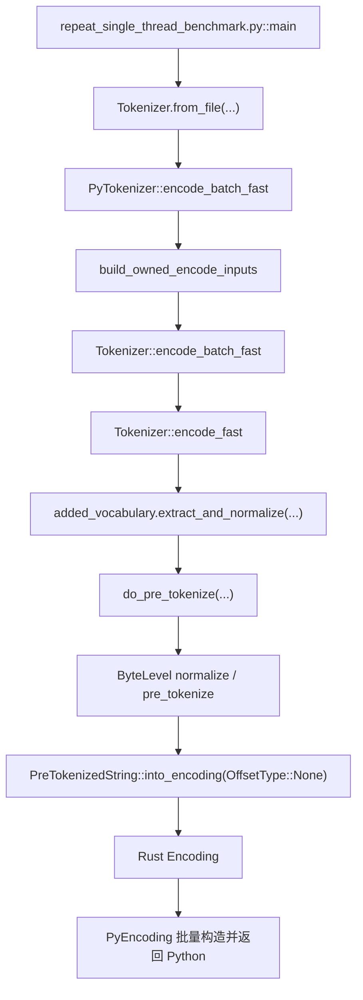

# Kunpeng-920 收益来源与代码路径分析报告

## 1. 结论摘要

这份报告聚焦已经在 Kunpeng-920 机器上验证过收益的提交链：`be1513cf -> a73478b1`。分析目标不是重新复现 benchmark，而是回答两个问题：

1. `+21.99%` 的端到端收益发生在什么执行路径上。
2. 这些收益分别和哪些代码改动直接相关。

本次收益口径来自 [Kunpeng-920性能验证报告.md](/Users/a111/Desktop/code/tokenizers/Kunpeng-920性能验证报告.md)：

- 基线提交：`be1513cf`
- 优化提交：`a73478b1`
- 场景：`Tokenizer.from_file(...).encode_batch_fast(...)`
- 线程：`1`
- 数据集：`facebook/xnli` `train`
- 文档数：`10000`
- 绑定核：`taskset -c 8`
- 结果：`1.74 MB/s -> 2.12 MB/s`，提升 `+21.99%`
- 稳定性：两组 `CV` 都约为 `0.1%`

需要先明确一点：这 `21.99%` 是端到端吞吐收益，不是单个函数的独享收益。它来自同一条编码链路上多个阶段的复合优化叠加，其中 `a73478b1` 的 byte-level fast path 是主贡献，`be1513cf` 中的 Python 输入快路径、`OffsetType::None` 直构造路径、`PyEncoding` freelist 则是前后两端的稳定贡献。

## 2. 本次 benchmark 的实际代码路径

当前 benchmark 的入口在 [bindings/python/benches/repeat_single_thread_benchmark.py](/Users/a111/Desktop/code/tokenizers/bindings/python/benches/repeat_single_thread_benchmark.py#L167)，它会加载本地 tokenizer，并在 `huggingface` 分支中直接调用 `hf_tokenizer.encode_batch_fast(batch)`。

主路径可以概括为：

如果按“耗时阶段”拆开，这条路径大致分成四段：

1. Python 输入编组：把 `list[str]` / `tuple[str, str]` 转成 Rust `EncodeInput`
2. Rust 正文处理：`extract_and_normalize -> do_pre_tokenize -> model tokenize`
3. Rust 结果组装：`PreTokenizedString::into_encoding(OffsetType::None)`
4. Python 回传阶段：把 Rust `Encoding` 包成 `PyEncoding`

这次收益和代码修改的关系，本质上就是对这四段中的三段做了减重，其中第二段的 byte-level 映射优化收益最大。

## 3. 为什么当前场景对 byte-level 路径特别敏感

本次 benchmark 并不是任意 tokenizer 用例，而是 Llama 3.1 相关 tokenizer 的单线程批量文本编码。这个场景有三个重要特征：

- 输入量大：`10000` 条文档，总字节量约 `24.04 MB`
- 返回量大：每轮要把 `10000` 个编码结果返回给 Python
- 使用 `encode_batch_fast`：不保留字符 offsets，因此理论上可以走更轻的 fast path

对于这类模型，`extract_and_normalize(...)` 和 `do_pre_tokenize(...)` 里的 byte-level 字节映射会反复作用在整批输入上。输入越大、字符串越多，这个阶段越容易成为稳定热点。也正因为如此，`a73478b1` 虽然只改了 3 个 Rust 文件，却能直接体现在 Kunpeng-920 的端到端吞吐上。

## 4. `be1513cf`：先把链路前后两端变轻

### 4.1 执行路径与改动位置

`be1513cf` 的收益不集中在单一热点，而是分布在编码链路的首尾两端：

- Python 输入提取快路径：
  - [bindings/python/src/tokenizer.rs](/Users/a111/Desktop/code/tokenizers/bindings/python/src/tokenizer.rs#L493)
  - [bindings/python/src/tokenizer.rs](/Users/a111/Desktop/code/tokenizers/bindings/python/src/tokenizer.rs#L551)
  - [bindings/python/src/tokenizer.rs](/Users/a111/Desktop/code/tokenizers/bindings/python/src/tokenizer.rs#L1342)
- `OffsetType::None` 下的 `Encoding` 直构造路径：
  - [tokenizers/src/tokenizer/pre_tokenizer.rs](/Users/a111/Desktop/code/tokenizers/tokenizers/src/tokenizer/pre_tokenizer.rs#L136)
- Python 返回对象分配优化：
  - [bindings/python/src/encoding.rs](/Users/a111/Desktop/code/tokenizers/bindings/python/src/encoding.rs#L11)

### 4.2 Python 输入提取快路径

在 `PyTokenizer` 中，文本输入现在优先走 `PyString -> to_cow() -> owned String`，对应代码在 [bindings/python/src/tokenizer.rs](/Users/a111/Desktop/code/tokenizers/bindings/python/src/tokenizer.rs#L493)。  
批量输入则统一通过 `build_owned_encode_inputs(...)` 处理，直接为 `list[str]`、`tuple[str, str]`、`list[str, str]` 构造 owned `EncodeInput`，对应 [bindings/python/src/tokenizer.rs](/Users/a111/Desktop/code/tokenizers/bindings/python/src/tokenizer.rs#L551) 和 [bindings/python/src/tokenizer.rs](/Users/a111/Desktop/code/tokenizers/bindings/python/src/tokenizer.rs#L1342)。

这部分优化减少的是 Python 到 Rust 的输入编组成本：

- 避免通用 `extract::<String>()` 的额外类型抽取和转换路径
- 对最常见的纯文本批量输入，减少中间判断和重复提取
- `encode_batch` 与 `encode_batch_fast` 共享一套 owned input builder，避免热路径走更重的分支

为什么这对当前 benchmark 有效：

- benchmark 每轮都把 `10000` 个 Python 文本对象送进 Rust
- 当前场景是纯文本输入，不是 pre-tokenized 输入
- 单线程下，输入编组开销不能被其他线程隐藏，会直接进入端到端耗时

这部分更像是“前端减阻”，一般不是最大热点，但它能稳定缩短进入 Rust tokenizer 之前的固定成本。

### 4.3 `OffsetType::None` 直达 `Encoding` 快路径

`encode_batch_fast` 的语义是“不保留 offsets”，因此 Rust 侧最终会走到 `PreTokenizedString::into_encoding(..., OffsetType::None)`。这条路径在 [tokenizers/src/tokenizer/pre_tokenizer.rs](/Users/a111/Desktop/code/tokenizers/tokenizers/src/tokenizer/pre_tokenizer.rs#L150) 做了关键优化：

- 先统计 `total_tokens`
- 直接 `Encoding::with_capacity(total_tokens)`
- 用循环逐个 `push(...)`
- 跳过通用路径里 `flat_map(...).collect()` 的 iterator 组装方式

这减少的是 Rust 结果组装阶段的通用抽象成本：

- 减少 iterator 链展开成本
- 减少 `Vec` 动态扩容
- 避免在 fast path 上继续沿用为 char/byte offset 设计的通用构造流程

为什么这对当前 benchmark 有效：

- 当前调用的就是 `encode_batch_fast(...)`
- `fast` 的核心前提就是不需要字符 offsets
- 文档数大时，`Encoding` 组装会重复发生很多次

这部分不是模型算法优化，而是让 “本来就不需要 offsets 的路径” 真正按轻量方式落地。

### 4.4 `PyEncoding` freelist

在 Python binding 层，`PyEncoding` 增加了 `freelist = 1024`，位置见 [bindings/python/src/encoding.rs](/Users/a111/Desktop/code/tokenizers/bindings/python/src/encoding.rs#L11)。

它减少的是批量返回结果时的 Python 对象分配与释放开销：

- `encode_batch_fast` 最终仍然返回 `list[Encoding]`
- benchmark 每轮要创建并回收大量 Python `Encoding` 包装对象
- freelist 让这类短生命周期对象的复用成本更低

为什么这对当前 benchmark 有效：

- benchmark 是高频重复轮次，不是一次性调用
- 返回结果数量和输入文档数同阶
- Rust 内部算完以后，Python 包装对象分配是绕不过去的尾段成本

这部分通常属于“配套优化”而不是主贡献，但它能压缩端到端尾部开销，提升整体吞吐的稳定性。

## 5. `a73478b1`：主收益来自 byte-level fast path

### 5.1 这次改动落在哪个阶段

`a73478b1` 的改动非常集中，只涉及 3 个文件：

- [tokenizers/src/tokenizer/normalizer.rs](/Users/a111/Desktop/code/tokenizers/tokenizers/src/tokenizer/normalizer.rs#L449)
- [tokenizers/src/pre_tokenizers/byte_level.rs](/Users/a111/Desktop/code/tokenizers/tokenizers/src/pre_tokenizers/byte_level.rs#L119)
- [tokenizers/src/normalizers/byte_level.rs](/Users/a111/Desktop/code/tokenizers/tokenizers/src/normalizers/byte_level.rs#L29)

它们都位于 `extract_and_normalize / do_pre_tokenize` 这段正文处理路径里，也就是最靠近文本本体处理的中段。

### 5.2 原实现的成本在哪里

优化前，byte-level 处理的核心思路是：

1. 读出当前 `NormalizedString`
2. 遍历字符与对应字节
3. 构造 `transformations: Vec<(char, isize)>`
4. 调用 `transform(...)`，再根据变换结果重建 normalized 内容与对齐信息

这个实现的优点是复用了通用变换框架，但对当前场景来说偏重，主要额外成本包括：

- 要先构造一个中间 `Vec<(char, isize)>`
- 需要做更多 iterator 展开与聚合
- 内容和对齐关系的重建不够直接

当输入是大批量文本时，这些“每个字符串都要重复一次”的中间成本会累计成稳定热点。

### 5.3 新实现为什么更轻

新实现引入了 `NormalizedString::map_bytes(...)`，位置在 [tokenizers/src/tokenizer/normalizer.rs](/Users/a111/Desktop/code/tokenizers/tokenizers/src/tokenizer/normalizer.rs#L449)。它的做法是：

- 直接取出 `self.normalized` 的底层字节流
- 同时取出原有 `alignments`
- 按字节逐个映射到 byte-level 字符
- 直接重建新的 `normalized` 与 `alignments`

然后 `ByteLevel` 的 normalizer 和 pre-tokenizer 两侧都改为直接调用这个入口：

- normalizer 侧见 [tokenizers/src/normalizers/byte_level.rs](/Users/a111/Desktop/code/tokenizers/tokenizers/src/normalizers/byte_level.rs#L29)
- pre-tokenizer 侧见 [tokenizers/src/pre_tokenizers/byte_level.rs](/Users/a111/Desktop/code/tokenizers/tokenizers/src/pre_tokenizers/byte_level.rs#L119)

它带来的实际变化不是“算法变了”，而是“同样的 byte-level 映射，用更贴近数据结构本体的方式完成”：

- 去掉中间 `transformations` 向量
- 减少通用 `transform(...)` 框架带来的附加开销
- 让文本内容与 alignment 的重建在同一个循环中完成

### 5.4 为什么它是这次 20% 收益的主贡献

这次 Kunpeng-920 benchmark 是单线程、长文本、10000 文档的端到端吞吐测试。在这种场景下：

- 输入编组和返回包装只发生在链路两端
- byte-level 映射发生在文本正文处理阶段，对每一条输入都要执行
- 文档越多、文本越长，这一阶段越容易成为稳定热点

所以 `a73478b1` 的收益特征和当前 benchmark 的放大条件是高度一致的：

- 改动位置正好位于正文热路径
- 改动对象正好是 byte-level tokenizer 的高频步骤
- 输入规模足够大，可以把中间向量与复制成本放大到吞吐层面

因此，从代码改动范围和调用位置来看，`a73478b1` 应视为这次 `+21.99%` 收益的主贡献来源。

## 6. 收益与代码修改关系映射

| 优化阶段 | 关键函数/路径 | 修改内容 | 减少的成本 | 对当前 benchmark 的作用方式 | 预期贡献强弱 |
| --- | --- | --- | --- | --- | --- |
| Python 输入编组 | `PyTokenizer::extract_owned_text` / `build_owned_encode_inputs` | 用 `PyString -> to_cow() -> owned String` 替代更通用的字符串提取，并为批量文本输入走直接 builder | Python 到 Rust 的类型提取、分支判断和中间编组成本 | 每轮把 `10000` 条文本送入 Rust，固定前置成本被直接压缩 | 次贡献 |
| Rust 结果组装 | `PreTokenizedString::into_encoding(OffsetType::None)` | 预统计 token 数并一次性分配 `Encoding`，改用直接 `push(...)` 组装 | iterator 链、`collect()`、动态扩容 | `encode_batch_fast` 天然不需要 offsets，这条轻路径会在所有样本上命中 | 次贡献 |
| Python 结果回传 | `PyEncoding` freelist | 为 `Encoding` Python 包装对象提供 freelist | Python 对象创建/销毁成本 | 每轮大批量返回结果，尾段包装更轻 | 配套优化 |
| byte-level 正文处理 | `NormalizedString::map_bytes` + `ByteLevel` normalizer/pre-tokenizer | 去掉中间 `transformations`，直接按字节重建 `normalized` 与 `alignments` | 中间向量构建、额外迭代、重复复制 | 处于文本正文热路径，且对所有输入高频执行 | 主贡献 |

这个表的重点不是“给每项优化分配精确百分比”，而是说明哪类改动作用于哪一段链路，以及哪一段更可能解释 Kunpeng-920 上观测到的主收益。

## 7. 为什么不能把 20% 简单等同于某一个单点改动

本次 benchmark 测的是端到端吞吐，而不是单函数 microbenchmark，因此有三个结论必须同时成立：

1. `+21.99%` 不是某个函数独立跑出来的收益，而是整条编码链路叠加后的结果。
2. `a73478b1` 虽然最可能是主贡献，但它仍然运行在 `be1513cf` 已经减重过的链路上。
3. 在没有逐提交 profiler 和阶段占比采样的前提下，只能做“路径级定性归因”，不能做“百分比分账”。

换句话说，这次收益更准确的理解应该是：

- `be1513cf` 先把输入编组、结果组装、Python 包装这些固定成本压下去
- `a73478b1` 再把正文处理中最稳定的一段 byte-level 映射热点显著减重
- 最终这些优化共同体现在 Kunpeng-920 的 `MB/s` 提升上

## 8. 行为保持不变的接口与语义

这次收益来自内部实现优化，没有新增对外 API。对调用方而言，重要行为保持不变：

- `Tokenizer.encode_batch_fast(...)` 仍然返回 `list[Encoding]`
- `fast` 路径下 `offsets` 仍然是全零占位语义
- 文本输入和 pair 输入行为保持兼容

这点也有现有回归测试支撑，见 [bindings/python/tests/bindings/test_tokenizer.py](/Users/a111/Desktop/code/tokenizers/bindings/python/tests/bindings/test_tokenizer.py#L158)。

## 9. 本报告使用的证据来源

本报告的结论来自以下材料的串联分析，而不是新的离线猜测：

- 验证结果：
  - [Kunpeng-920性能验证报告.md](/Users/a111/Desktop/code/tokenizers/Kunpeng-920性能验证报告.md)
- benchmark 入口与调用方式：
  - [bindings/python/benches/repeat_single_thread_benchmark.py](/Users/a111/Desktop/code/tokenizers/bindings/python/benches/repeat_single_thread_benchmark.py#L167)
- Python binding 热路径：
  - [bindings/python/src/tokenizer.rs](/Users/a111/Desktop/code/tokenizers/bindings/python/src/tokenizer.rs#L493)
  - [bindings/python/src/tokenizer.rs](/Users/a111/Desktop/code/tokenizers/bindings/python/src/tokenizer.rs#L551)
  - [bindings/python/src/tokenizer.rs](/Users/a111/Desktop/code/tokenizers/bindings/python/src/tokenizer.rs#L1342)
  - [bindings/python/src/encoding.rs](/Users/a111/Desktop/code/tokenizers/bindings/python/src/encoding.rs#L11)
- Rust fast path：
  - [tokenizers/src/tokenizer/pre_tokenizer.rs](/Users/a111/Desktop/code/tokenizers/tokenizers/src/tokenizer/pre_tokenizer.rs#L136)
  - [tokenizers/src/tokenizer/normalizer.rs](/Users/a111/Desktop/code/tokenizers/tokenizers/src/tokenizer/normalizer.rs#L449)
  - [tokenizers/src/pre_tokenizers/byte_level.rs](/Users/a111/Desktop/code/tokenizers/tokenizers/src/pre_tokenizers/byte_level.rs#L119)
  - [tokenizers/src/normalizers/byte_level.rs](/Users/a111/Desktop/code/tokenizers/tokenizers/src/normalizers/byte_level.rs#L29)
- 正确性回归：
  - [bindings/python/tests/bindings/test_tokenizer.py](/Users/a111/Desktop/code/tokenizers/bindings/python/tests/bindings/test_tokenizer.py#L158)

## 10. 后续如果要继续做更细归因

如果后续需要把“主贡献/次贡献”进一步收敛成更接近量化的结论，建议按下面顺序继续做：

1. 分别对 `be1513cf` 与 `a73478b1` 做同口径独立 benchmark，确认单提交增量。
2. 对 `encode_batch_fast` 路径做 profiler 采样，观察 `extract_and_normalize`、`do_pre_tokenize`、`into_encoding`、Python 包装阶段的占比变化。
3. 再决定是否需要进一步拆出 microbenchmark，例如单独测 `map_bytes(...)` 或 `OffsetType::None` 的构造路径。

在当前证据下，可以稳定成立的结论是：

- `be1513cf` 负责把这条链路的两端固定成本压低
- `a73478b1` 命中了正文热路径，是本次 Kunpeng-920 `+21.99%` 收益的主贡献来源
- 这是一条端到端复合收益链，而不是单一补丁的孤立效果
